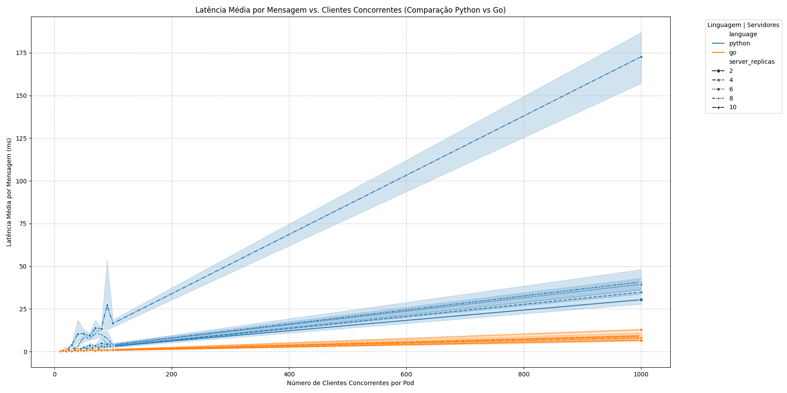
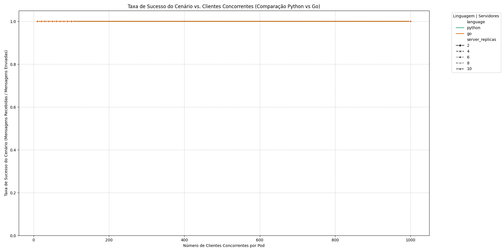
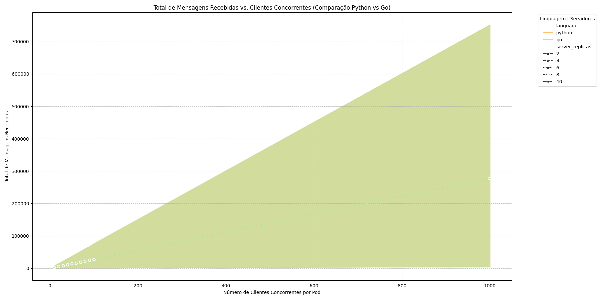
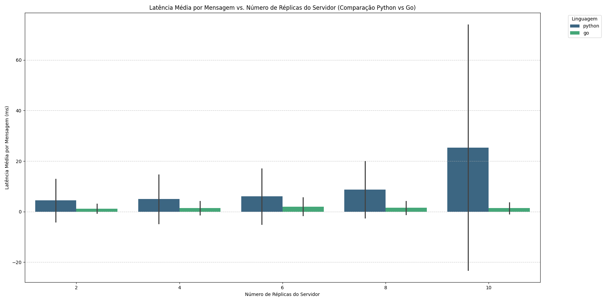
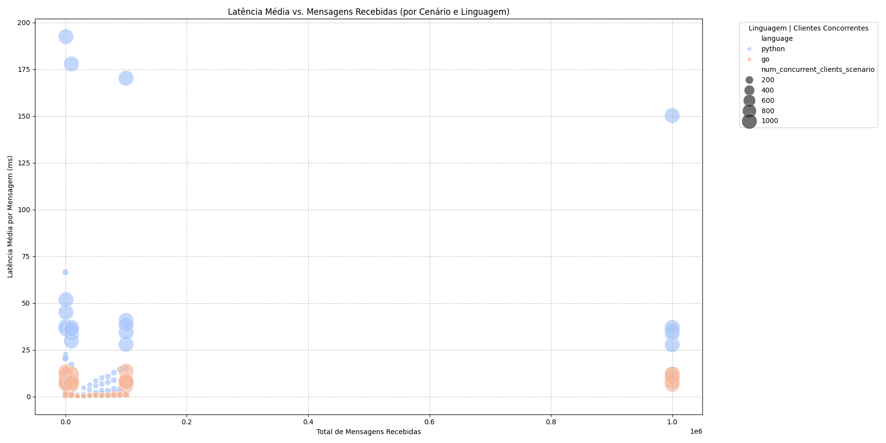

# Projeto: Avaliação de Escalabilidade de Aplicações Cliente-Servidor TCP/IP em Kubernetes

![Capa do Projeto - Exemplo de logo ou ícone de Kubernetes com clientes/servidores]

---

## 🚀 Visão Geral do Projeto

Este projeto visa avaliar a escalabilidade e o desempenho de aplicações cliente-servidor baseadas em protocolo TCP/IP, utilizando as poderosas ferramentas de conteinerização Docker e orquestração Kubernetes. O foco principal é analisar como as implementações de servidor e cliente em diferentes linguagens (Python e Go) se comportam sob variadas cargas de trabalho, identificando gargalos, comparando eficiências e fornecendo insights valiosos para o dimensionamento de sistemas distribuídos.

Diferente de abordagens tradicionais, o projeto utiliza um **cliente de teste persistente** dentro do cluster Kubernetes, que é instruído dinamicamente a gerar diferentes níveis de carga, otimizando o overhead de criação e deleção de pods a cada cenário de teste.

---

## ✨ Funcionalidades Principais

* **Implementações Múltiplas:** Servidores e clientes desenvolvidos em Python (com `asyncio`) e Go (com `goroutines`), permitindo uma comparação de desempenho entre linguagens.
* **Protocolo TCP/IP Customizado:** Comunicação cliente-servidor baseada em um protocolo de eco simples sobre TCP, fundamental para os testes.
* **Controle de Teste Otimizado:** O cliente de teste atua como um serviço persistente no Kubernetes, recebendo comandos via um protocolo TCP customizado para iniciar e gerenciar os testes de carga, eliminando o overhead de criação de pods por cenário.
* **Orquestração Kubernetes:** Gerenciamento automatizado de deployments de servidor (escalável) e cliente de teste (persistente), e serviços para comunicação interna.
* **Testes de Carga Abrangentes:** Cenários configuráveis que variam o número de réplicas de servidor, a quantidade de clientes concorrentes (aumentando e diminuindo a carga) e o número de mensagens por cliente.
* **Coleta e Processamento de Dados:** Logs detalhados são coletados em formato JSON, processados por scripts Python e consolidados em arquivos CSV para análise estatística.
* **Geração Automática de Gráficos:** Visualizações claras e informativas são geradas para facilitar a interpretação dos resultados de desempenho.
* **Automação Completa:** Um único script Bash orquestra todo o ciclo de vida do projeto, desde a construção das imagens até a geração dos resultados finais.

---

## 🛠️ Pré-requisitos de Instalação

Para executar este projeto, você precisará ter os seguintes componentes instalados em seu sistema Ubuntu (ou similar):

* **Docker:** Para construção e gerenciamento de imagens de contêiner.
    * Instalação: Siga a documentação oficial do Docker para Ubuntu.
* **Minikube** (ou outro cluster Kubernetes local, como Kind ou Docker Desktop com Kubernetes ativado): Para simular um ambiente Kubernetes.
    * Instalação Minikube: `curl -LO https://storage.googleapis.com/minikube/releases/latest/minikube-linux-amd64 && sudo install minikube-linux-amd64 /usr/local/bin/minikube && rm minikube-linux-amd64`
* **kubectl:** A ferramenta de linha de comando para interação com o cluster Kubernetes.
    * Instalação kubectl: `sudo snap install kubectl --classic` ou `sudo apt-get update && sudo apt-get install -y kubectl`
* **Python 3.x:** Para compatibilidade com os códigos Python do cliente, servidor e scripts de automação.
    * Verificar: `python3 --version`
* **`pip` (gerenciador de pacotes Python):**
    * Instalar: `sudo apt install python3-pip`
* **Bibliotecas Python:** `pandas`, `matplotlib`, `seaborn`.
    * Instalar: `pip install pandas matplotlib seaborn`
* **`jq`:** Ferramenta de linha de comando para processamento de JSON, utilizada pelos scripts.
    * Instalar: `sudo apt install jq`

---

## 🚀 Guia de Execução

Para rodar o projeto, siga estes passos. É **fundamental que todos os arquivos de código-fonte estejam na raiz do diretório do projeto** (juntamente com as pastas `logs/`).

1.  **Clonar o Repositório:**
    ```bash
    git clone [https://github.com/CristhianKapelinski/k8s-client-server-load-test.git](https://github.com/CristhianKapelinski/k8s-client-server-load-test.git)
    cd k8s-client-server-load-test # Navegue até o diretório raiz do projeto clonado
    ```

2.  **Preparação do Ambiente:**
    * Certifique-se de que **todos os arquivos de código-fonte** (`.py`, `.go`, `.sh`, `.yaml`, `Dockerfile.*`) estejam **diretamente na raiz do projeto clonado**.


3.  **Configurar Usuário do Docker Hub:**
    Edite o arquivo `run_tests.sh` (que agora está na raiz) e defina a variável `DOCKER_USER` com seu nome de usuário do Docker Hub:
    ```bash
    # Dentro de run_tests.sh
    DOCKER_USER="seu_usuario_dockerhub"
    ```

4.  **Realizar Login no Docker Hub:**
    ```bash
    docker login
    ```

5.  **Iniciar o Cluster Kubernetes (Ex: Minikube):**
    ```bash
    minikube start --driver=docker
    ```
    Aguarde a completa inicialização do Minikube. Verifique o status com `minikube status`.

6.  **Conceder Permissão de Execução ao Script Principal:**
    ```bash
    chmod +x run_tests.sh
    ```

7.  **Executar o Script de Testes:**
    Este comando executará todo o ciclo de vida do projeto: limpeza de recursos, construção e envio de imagens Docker (Python e Go), implantação de servidores e clientes de teste no Kubernetes, execução dos cenários de carga, coleta de logs, processamento de dados e geração de gráficos.

    ```bash
    ./run_tests.sh
    ```
    O script levará um tempo considerável para ser concluído, pois executará uma matriz de cenários abrangente.

---

## 📁 Estrutura do Repositório

Ao clonar este repositório, você encontrará a seguinte estrutura:

```
. (raiz do projeto)
├── analyze_results.py              # Script Python para análise estatística dos resultados
├── client.py                       # Cliente de teste persistente (Python)
├── client.go                       # Cliente de teste persistente (Go)
├── client-deployment.yaml          # Deployment do cliente de teste no Kubernetes
├── client_control_proxy.py         # Script auxiliar para controlar o cliente via TCP
├── Dockerfile.client               # Dockerfile do cliente Python
├── Dockerfile.client.go            # Dockerfile do cliente Go
├── Dockerfile.server               # Dockerfile do servidor Python
├── Dockerfile.server.go            # Dockerfile do servidor Go
├── generate_graphs.py              # Script Python para geração dos gráficos
├── process_logs.py                 # Script Python para processar logs brutos JSON
├── run_tests.sh                    # Script Bash principal de automação do projeto
├── server.py                       # Servidor TCP (Python)
├── server.go                       # Servidor TCP (Go)
├── server-deployment.yaml          # Deployment do servidor no Kubernetes
├── test_build.sh                   # Script auxiliar para testar builds Docker
│                                   # (não faz parte do fluxo principal do run_tests.sh)
│
├── logs/                           # Diretório para logs e resultados
│   ├── graphs/                     # Gráficos PNG gerados
│   │   ├── average_latency_vs_concurrent_clients_language_comparison.png
│   │   ├── average_latency_vs_server_replicas_language_comparison.png
│   │   ├── latency_vs_messages_language_scatter.png
│   │   ├── success_rate_vs_concurrent_clients_language_comparison.png
│   │   └── total_messages_received_vs_concurrent_clients_language_comparison.png
│   ├── raw_client_logs/            # Logs brutos (JSON) por linguagem (go/ e python/)
│   ├── results_combined.csv        # CSV final com todos os resultados
│   ├── results_go.csv              # CSV com resultados Go
│   ├── results_python.csv          # CSV com resultados Python
│   └── (outros logs de pods e deployments)
│
└── README.md                       # Este arquivo
```

## 📊 Análise de Resultados e Gráficos

A execução do script `run_tests.sh` gera um conjunto abrangente de dados de desempenho, que são processados e visualizados para facilitar a interpretação. Os gráficos em `logs/graphs/` oferecem uma representação visual clara das tendências e comparações.

### Interpretação dos Resultados Chave:

Os testes abrangem uma vasta gama de cenários, variando o número de réplicas de servidor, o volume de clientes concorrentes (de 1 a 1000, e vice-versa) e o número de mensagens por cliente (1, 10, 100, 1000).

1.  **Robustez e Taxa de Sucesso:**
    * Ambas as implementações (Python e Go) demonstraram uma **taxa de sucesso de 100%** em todos os cenários testados. Isso é um indicativo excepcional de robustez na entrega e processamento das mensagens, sem perdas ou falhas de conexão, mesmo sob as condições de estresse mais elevadas. Isso valida a confiabilidade tanto das implementações quanto da infraestrutura Kubernetes.

2.  **Latência Média: Go vs. Python:**
    * **Go:** Apresentou uma latência média significativamente menor e mais consistente. Em cenários de baixa carga, a latência média foi extremamente baixa (entre **0.14 ms e 0.34 ms**). Mesmo sob cargas muito elevadas, a latência do Go permaneceu notavelmente baixa, atingindo no máximo **12.12 ms**. O aumento no número de réplicas de servidores contribuiu para uma diminuição ainda maior da latência em Go, demonstrando sua excelente escalabilidade horizontal.
    * **Python:** Enquanto as latências iniciais em Python são comparáveis às de Go em cargas muito baixas, o desempenho se degrada mais visivelmente à medida que a carga aumenta. Em cenários de alta concorrência, a latência do Python pode atingir valores como **33.85 ms**, e picos extremos chegaram a **192.43 ms**.
    * **Conclusão:** A implementação em Go é, em média, mais rápida e mais consistente (com menor desvio padrão) que a implementação em Python, especialmente sob cargas elevadas. A natureza compilada de Go e seu modelo de concorrência com goroutines oferecem um overhead menor e latências mais previsíveis para esta workload intensiva.

3.  **Capacidade de Processamento:**
    * Ambas as linguagens e a arquitetura Kubernetes demonstraram ser capazes de processar um volume massivo de mensagens. O sistema foi testado para lidar com cenários de até **1.000.000 de mensagens recebidas** em uma única combinação de cenário, com sucesso.

### Visualização dos Resultados:

Os gráficos abaixo ilustram as principais tendências de desempenho e a comparação entre as implementações Python e Go.

#### Latência Média vs. Clientes Concorrentes

Este gráfico mostra como a latência média por mensagem se comporta à medida que o número de clientes concorrentes aumenta, com linhas separadas para diferentes configurações de servidor e linguagens. Observa-se claramente a vantagem de latência do Go sobre o Python, especialmente em cargas mais altas.



#### Taxa de Sucesso vs. Clientes Concorrentes

Este gráfico demonstra a robustez do sistema, exibindo a taxa de sucesso das mensagens em relação ao número de clientes concorrentes. A constância em 100% para ambas as linguagens em todos os cenários é um ponto forte do projeto.



#### Total de Mensagens Recebidas vs. Clientes Concorrentes

Este gráfico visualiza o volume total de mensagens que o sistema conseguiu processar com sucesso para cada configuração de cliente concorrente. Ele reforça a capacidade do sistema de lidar com grandes volumes de dados.



#### Latência Média vs. Réplicas do Servidor

Este gráfico de barras compara a latência média em relação ao número de réplicas do servidor, para ambas as linguagens. Ele destaca como a escalabilidade horizontal (adicionar mais servidores) impacta a redução da latência e a capacidade de resposta do sistema.



#### Latência Média vs. Mensagens Recebidas (Scatter Plot)

Este gráfico de dispersão oferece uma visão mais detalhada da relação entre o volume total de mensagens processadas e a latência média, discriminando por linguagem e indicando a intensidade da concorrência (tamanho dos pontos).



---

## 💡 Próximos Passos e Otimizações Futuras

* **Análise de Throughput:** Embora a latência e a taxa de sucesso sejam cruciais, o throughput (mensagens por segundo) é outra métrica vital. A implementação da coleta de dados de throughput (tempo total de execução de cada cenário) pode fornecer uma visão mais completa.
* **Monitoramento Avançado:** Integrar ferramentas de monitoramento de cluster Kubernetes (como Prometheus e Grafana) para coletar métricas de CPU, memória e rede dos pods durante os testes pode fornecer insights mais profundos sobre o uso de recursos e gargalos.
* **Testes de Resiliência:** Explorar cenários de falha (ex: derrubar pods de servidor durante um teste) para avaliar a resiliência do sistema e a eficácia das retentativas do cliente.

---

## 🤝 Contribuições

Contribuições são bem-vindas! Sinta-se à vontade para abrir issues, enviar pull requests ou sugerir melhorias.

---

## 📄 Licença

Este projeto está licenciado sob a licença MIT. Veja o arquivo `LICENSE` para mais detalhes.

---

**Autor:** Seu Nome / Nome da Equipe
**Data:** 15 de Junho de 2025